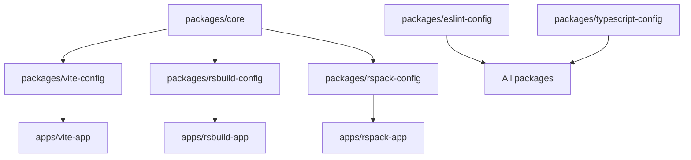

# System Patterns: iCondo Compiler

## Architecture Overview

### Monorepo Structure
```
icondo-compiler/
├── packages/
│   ├── core/                    # Shared utilities and types
│   ├── vite-config/            # Vite-specific configuration
│   ├── rsbuild-config/         # Rsbuild-specific configuration
│   ├── rspack-config/          # Rspack-specific configuration
│   ├── eslint-config/          # Shared ESLint configurations
│   └── typescript-config/      # Shared TypeScript configurations
├── apps/                       # Example applications
│   ├── vite-app/              # Vite demo application
│   ├── rsbuild-app/           # Rsbuild demo application
│   └── rspack-app/            # Rspack demo application
└── memory-bank/               # Project documentation
```

## Core Design Patterns

### Plugin-Based Architecture
**Pattern**: Functional composition with plugin functions that transform configuration objects

```typescript
// Plugin signature pattern
type ConfigPlugin<TConfig, TContext> = (
  config: TConfig,
  context?: TContext
) => TConfig

// Composition pattern
const composePlugins = (...plugins: ConfigPlugin[]) =>
  (initialConfig: Config) =>
    plugins.reduce((config, plugin) => plugin(config), initialConfig)
```

**Benefits**:
- Modular and extensible
- Type-safe composition
- Easy testing of individual plugins
- Consistent API across bundlers

### Type-Safe Configuration System
**Pattern**: Generic interfaces with bundler-specific implementations

```typescript
// Base shared types
interface BasePluginContext {
  mode?: "development" | "production"
  projectRoot?: string
  outputPath?: string
}

// Bundler-specific extensions
interface VitePluginContext extends BasePluginContext {
  // Vite-specific context
}

interface RspackPluginContext extends BasePluginContext {
  // Rspack-specific context
}
```

**Benefits**:
- IntelliSense support across all bundlers
- Compile-time validation
- Consistent developer experience
- Easy refactoring and maintenance

### Shared Utilities Pattern
**Pattern**: Common utilities in core package, imported by bundler-specific packages

```typescript
// Core package exports
export const COMMON_EXTENSIONS = ['.js', '.jsx', '.ts', '.tsx']
export const createCommonAliases = () => ({ /* aliases */ })
export const createCommonRules = () => ({ /* rules */ })

// Bundler packages import and use
import { COMMON_EXTENSIONS, createCommonAliases } from '@stageit-labs/core'
```

**Benefits**:
- Consistency across bundlers
- Single source of truth
- Reduced duplication
- Easier maintenance

## Key Technical Decisions

### Build System Choice: rslib
**Decision**: Use rslib for compiling all packages

**Rationale**:
- TypeScript declaration generation
- ESM module support
- Fast compilation
- Good integration with monorepo

**Alternatives Considered**: tsc, rollup, esbuild
**Impact**: Fast builds, proper type generation, consistent output

### Module Resolution Strategy
**Decision**: Use "bundler" module resolution instead of "NodeNext"

**Rationale**:
- Avoids .js extension requirements
- Better compatibility with bundlers
- Cleaner import statements
- Less configuration overhead

**Impact**: Simpler imports, better developer experience

### Package Naming Convention
**Decision**: Use `@stageit-labs/*` namespace with descriptive names

**Pattern**:
- `@stageit-labs/core` - Shared utilities
- `@stageit-labs/vite-config` - Vite configuration
- `@stageit-labs/rsbuild-config` - Rsbuild configuration
- `@stageit-labs/rspack-config` - Rspack configuration

**Benefits**: Clear ownership, easy discovery, namespace isolation

### Version Management Strategy
**Decision**: Unified dependency versions across all packages

**Implementation**:
- Single pnpm-lock.yaml at root
- Consistent peer dependency versions
- Coordinated releases
- Shared dev dependencies

**Benefits**: Eliminates version conflicts, easier maintenance

## Component Relationships

### Dependency Flow


### Plugin Composition Flow


## Error Handling Patterns

### Plugin Validation
**Pattern**: Validate inputs and provide meaningful errors

```typescript
export function withBase(options: WithBaseOptions = {}) {
  return (config: Config, context: Context = {}) => {
    // Validate plugin is function
    if (typeof plugin !== 'function') {
      throw new Error(`Expected plugin to be function, got ${typeof plugin}`)
    }

    // Validate options
    if (options.mode && !['development', 'production'].includes(options.mode)) {
      throw new Error(`Invalid mode: ${options.mode}`)
    }

    // Apply plugin safely
    try {
      return applyPlugin(config, context, options)
    } catch (error) {
      throw new Error(`Plugin withBase failed: ${error.message}`)
    }
  }
}
```

### Configuration Merging
**Pattern**: Deep merge with array preservation

```typescript
const mergeConfigs = (base: Config, override: Config): Config => {
  return {
    ...base,
    ...override,
    // Preserve arrays instead of overwriting
    plugins: [...(base.plugins || []), ...(override.plugins || [])],
    // Deep merge complex objects
    build: { ...base.build, ...override.build }
  }
}
```

## Performance Patterns

### Lazy Loading
**Pattern**: Load heavy dependencies only when needed

```typescript
// Lazy load bundler-specific plugins
const loadVitePlugin = async () => {
  const { default: plugin } = await import('@vitejs/plugin-react')
  return plugin
}
```

### Caching Strategy
**Pattern**: Leverage Turbo and pnpm caching

- Turbo caches build outputs
- pnpm caches dependencies
- TypeScript incremental compilation
- Deterministic build artifacts

## Testing Patterns

### Plugin Unit Testing
**Pattern**: Test plugins in isolation with mock configurations

```typescript
describe('withBase plugin', () => {
  it('should apply base configuration', () => {
    const mockConfig = {}
    const mockContext = { mode: 'development' }
    const plugin = withBase({ outputPath: 'dist' })

    const result = plugin(mockConfig, mockContext)

    expect(result.build.outDir).toBe('dist')
  })
})
```

### Integration Testing
**Pattern**: Test complete configuration builds

```typescript
describe('Vite configuration', () => {
  it('should build successfully', async () => {
    const config = composePlugins(
      withBase(),
      withReact()
    )

    const result = await buildWithConfig(config)
    expect(result.success).toBe(true)
  })
})
```

## Documentation Patterns

### API Documentation
**Pattern**: JSDoc comments with TypeScript types

```typescript
/**
 * Base plugin that provides essential configuration for all bundlers
 *
 * @param options - Configuration options for base setup
 * @param options.mode - Build mode (development/production)
 * @param options.outputPath - Output directory path
 * @returns Plugin function that transforms configuration
 *
 * @example
 * ```typescript
 * const config = composePlugins(
 *   withBase({ mode: 'development', outputPath: 'dist' })
 * )
 * ```
 */
export function withBase(options: WithBaseOptions = {}): ConfigPlugin
```

### Examples Pattern
**Pattern**: Working examples in apps/ directory demonstrating real usage

This ensures patterns stay current and provide immediate value to developers learning the system.
